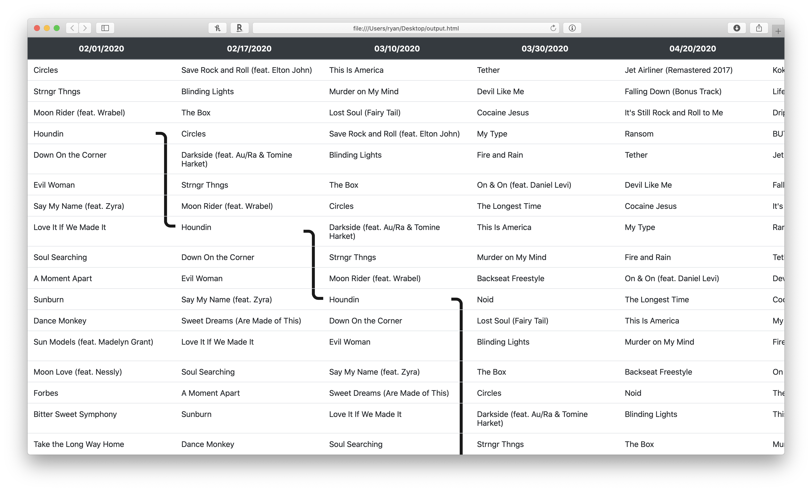

# iTunesTimeMachine
Visualize how your playlist changes over time using git

## How it works
  1. Setup a git repository
  2. In iTunes, go to File > Library > Export Playlist. Save the export as an XML file in the git repo you created in Step 1
  3. Commmit the file into git
  4. Repeat step 2 & 3 however often you want to see snapshots of your playlist (ex: every month)
  
  When you want to visualize how the playlist has changed over time, run `python3 generateHistory.py PATH/TO/GIT/REPO`. It will generate an interactive HTML file that can trace a song through your playlist history by clicking on a song name
